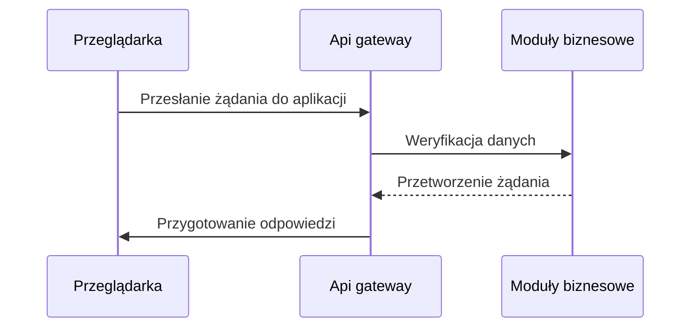

# Remote as Local - POC

Test możliwości biblioteki cglib: próba wygodnego zdalnego używania implementacji interfejsów.

```mermaid  
sequenceDiagram  
Przeglądarka ->> Api gateway:Przesłanie żądania do aplikacji
Api gateway->>Moduły biznesowe:Weryfikacja danych
Moduły biznesowe-->>Api gateway:Przetworzenie żądania
Api gateway->> Przeglądarka: Przygotowanie odpowiedzi
```
